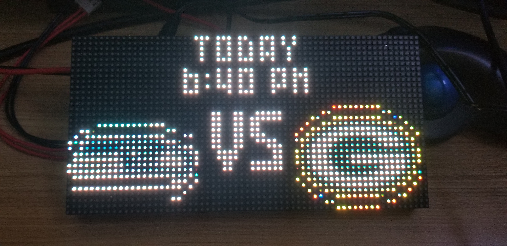
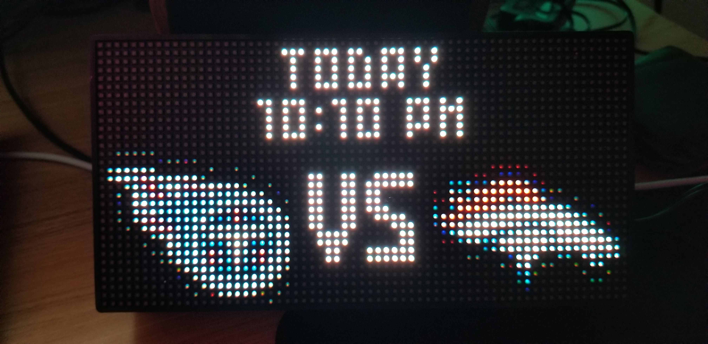
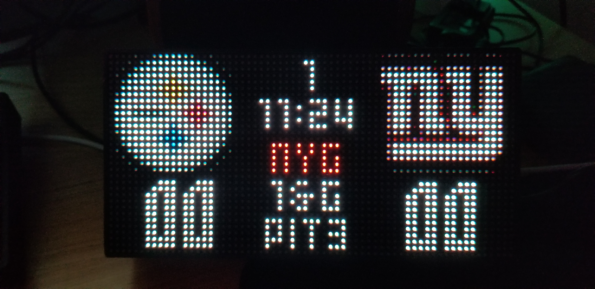
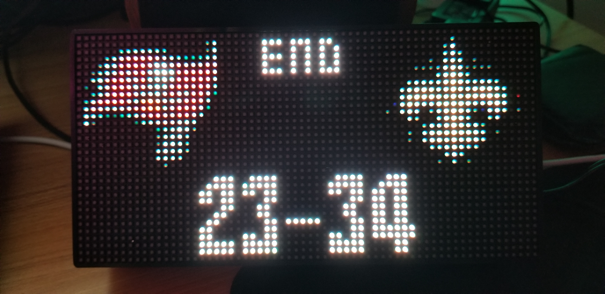

# nfl-led-scoreboard


Display your favourite NFL team score on an raspberry pi powered LED matrix. Currently supports 64x32 boards only.

### Credit and inpsiration
This project and my [Fantasy Football scoreboard project](https://github.com/mikemountain/fantasy-football-scoreboard) were inspired by the [nhl-led-scoreboard](https://github.com/riffnshred/nhl-led-scoreboard), who based THEIR project off of the [mlb-led-scoreboard](https://github.com/MLB-LED-Scoreboard/mlb-led-scoreboard). Go check them out, and start watching hockey if you don't already (and baseball too but I love hockey more (go Leafs!)).

### Donate
<a href="https://paypal.me/themikemountain/"></a>  
If you enjoyed this project, my NFL project, or if you're just feeling generous, consider buying me a beer. Cheers! :beers: 
You can also PM me on reddit under /u/mikemountain if you need help but don't think it requires an issue!

## Features (v0.1.0)

### GAME ROTATION
Hey, neat-o! You can rotate through multiple games now if you want to! Will still need some finessing, but definitely an improvement.

### Pregame
Currently shows the team logos and the game time. 

### Live scoring updates 
The score updates every 3 seconds. The scoreboard will display, from top to bottom: quarter, time remaining in quarter, team with possession, down and yards to gain, and the position of the line of scrimmage.  When a team is in the redzone, their name will light up red. 

### Postgame
Just kind of looks like the pre-game screen but with the final scores. 

### Off season
It displays a message that it's the off season. You should just turn it off and plan to be heartbroken again next year.

### Preseason
Nothing yet because I didn't even think the season would start because of COVID.

## Roadmap

Future plans include:
* team colours for the score/possession maybe?
* better/more gifs I guess?
* general stability? I actually achieved all the goals I set out to do with this thing so I dunno what else I wanna do.

## Installation
### Hardware Assembly
The [mlb-led-scoreboard guys made a great wiki page to cover the hardware part of the project](https://github.com/MLB-LED-Scoreboard/mlb-led-scoreboard/wiki). There's also this [very handy howchoo page](https://howchoo.com/g/otvjnwy4mji/diy-raspberry-pi-nhl-scoreboard-led-panel) which is what I mainly followed.

### Software Installation
#### Raspbian Distribution
It is recommended you install the Lite version of Raspbian from the [Raspbian Downloads Page](https://www.raspberrypi.org/downloads/raspbian/). This version lacks a GUI, allowing your Pi to dedicate more system resources to drawing the screen.
Make sure to set the timezone to your local timezone!

#### Requirements
You need Git for cloning this repo and PIP for installing the scoreboard software.
```
sudo apt-get update
sudo apt-get install git python-pip
```

#### Installing the software
This installation process might take some time because it will install all the dependencies listed below.

```
git clone --recursive https://github.com/mikemountain/nfl-led-scoreboard
cd nfl-led-scoreboard/
sudo chmod +x install.sh
sudo ./install.sh
```
[rpi-rgb-led-matrix](https://github.com/hzeller/rpi-rgb-led-matrix/tree/master/bindings/python#building): The open-source library that allows the Raspberry Pi to render on the LED matrix.

[requests](https://requests.kennethreitz.org/en/master/): To call the API and manipulate the received data.

## Testing & Optimization (IMPORTANT)
If you have used a LED matrix on a raspberry pi before and know how to run it properly, then you can skip this part. 

If you just bought your LED matrix and want to run this software right away, reference the [rpi-rgb-led-matrix library](https://github.com/hzeller/rpi-rgb-led-matrix/). Check out the section that uses the python bindings and run some of their examples on your screen. For sure you will face some issues at first, but don't worry, more than likely there's a solution you can find in their troubleshooting section.
Once you found out how to make it run smoothly, come back here and do what's next.

### Adafruit HAT/bonnet
If you are using any thing from raspberry pi 3+ to the newest versions with an Adafruit HAT or Bonnet, here's what [RiffnShred](https://github.com/riffnshred) did to run his board properly. It seems these are more recommendations than things you 100% absolutely need to do, but are probably beneficial anyway.

* Do the hardware mod found in the [Improving flicker section ](https://github.com/hzeller/rpi-rgb-led-matrix#improving-flicker).
* Disable the on-board sound. You can find how to do it from the [Troubleshooting sections](https://github.com/hzeller/rpi-rgb-led-matrix#troubleshooting)
* From the same section, run the command that remove the bluetooth firmware, unless you use any bluetooth device with your pi.

Finally, here's the command he used.
```
sudo python main.py --led-gpio-mapping=adafruit-hat-pwm --led-brightness=60 --led-slowdown-gpio=2
```

## Usage
Open the config.json file from the root folder and change these values:

* ```fav_team``` Set this as your favourite team, but it doesn't do anything yet (for next season)

Now, in a terminal, cd to the nfl-led-scoreboard folder and run this command. 
```
sudo python main.py 
```
**If you run your screen on an Adafruit HAT or Bonnet, you need to supply this flag.**
```
sudo python main.py --led-gpio-mapping=adafruit-hat
```

### Flags
Use the same flags used in the [rpi-rgb-led-matrix](https://github.com/hzeller/rpi-rgb-led-matrix/) library to configure your screen.
```
--led-rows                Display rows. 16 for 16x32, 32 for 32x32. (Default: 32)
--led-cols                Panel columns. Typically 32 or 64. (Default: 32)
--led-chain               Daisy-chained boards. (Default: 1)
--led-parallel            For Plus-models or RPi2: parallel chains. 1..3. (Default: 1)
--led-pwm-bits            Bits used for PWM. Range 1..11. (Default: 11)
--led-brightness          Sets brightness level. Range: 1..100. (Default: 100)
--led-gpio-mapping        Hardware Mapping: regular, adafruit-hat, adafruit-hat-pwm
--led-scan-mode           Progressive or interlaced scan. 0 = Progressive, 1 = Interlaced. (Default: 1)
--led-pwm-lsb-nanosecond  Base time-unit for the on-time in the lowest significant bit in nanoseconds. (Default: 130)
--led-show-refresh        Shows the current refresh rate of the LED panel.
--led-slowdown-gpio       Slow down writing to GPIO. Range: 0..4. (Default: 1)
--led-no-hardware-pulse   Don't use hardware pin-pulse generation.
--led-rgb-sequence        Switch if your matrix has led colors swapped. (Default: RGB)
--led-pixel-mapper        Apply pixel mappers. e.g Rotate:90, U-mapper
--led-row-addr-type       0 = default; 1 = AB-addressed panels. (Default: 0)
--led-multiplexing        Multiplexing type: 0 = direct; 1 = strip; 2 = checker; 3 = spiral; 4 = Z-strip; 5 = ZnMirrorZStripe; 6 = coreman; 7 = Kaler2Scan; 8 = ZStripeUneven. (Default: 0)
```

## Licensing
This project uses the GNU General Public License v3.0. If you intend to sell these, the code must remain open source and you at least have to tell people how cool I am (please, I need this).
